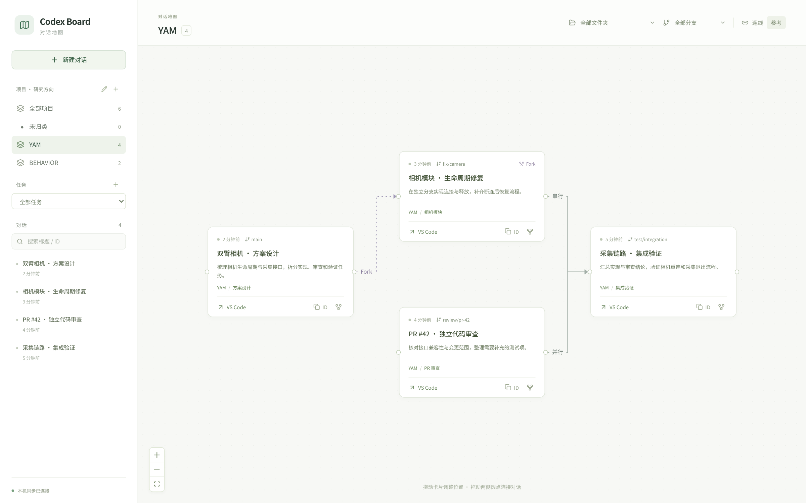

<div align="center">

# Codex Board

### 让每段对话，都有自己的位置。

A local conversation map for Codex. Organize your work. Find the right thread. Jump back into VS Code.

[**产品主页**](https://scilwb.github.io/codex-board/) · [**快速开始**](#快速开始) · [**使用方式**](#使用方式) · [**English**](#english)

[](https://github.com/scilwb/codex-board/actions/workflows/ci.yml)
[](LICENSE)
[](package.json)

</div>



开着多个项目、多个分支、多个 Codex 对话时，找到“负责这件事的那一条”应该很简单。

Codex Board 把本机对话放进一张可整理的地图。按研究方向和任务归类，拖拽连接关系，再一键回到 VS Code 继续工作。

## 可以做什么

| 功能 | 用途 |
|---|---|
| 项目与任务 | 手动管理 YAM、BEHAVIOR 等研究方向，以及代码模块、PR 审查等任务；一个项目可跨多个文件夹。 |
| 文件夹与分支 | 保留实际工作路径和会话记录的 Git 分支，可独立筛选。 |
| 对话关系 | 拖拽连线，标记串行、并行或参考；真实 Fork 来源自动显示。 |
| 回到 VS Code | 优先复用已经打开的对话标签，并定位到对应窗口。 |
| 新建、Fork 与继承 | Fork 延续来源上下文；继承创建独立对话，只装入可编辑的短交接资料，适合长对话续聊。 |
| 实时同步与 ID | 每 2 秒检查本机会话变化；搜索标题或 ID，一键复制具体会话 ID。 |

**管理操作不发起模型推理。** 浏览、归类、拖拽、复制和跳转没有额外模型 token 消耗；后续在 Codex 中运行对话仍遵循你的 Codex 账户与使用规则。

## 快速开始

当前验证环境为 **Linux**。需要：

- Node.js **22.13+**（推荐 Node 24）与 npm。
- VS Code 和 Codex 扩展；已经在本机创建过 Codex 对话，存在本地会话索引。
- Python 3，用于打包轻量 VS Code 桥接扩展。

### 1. 启动对话地图

```bash
git clone https://github.com/scilwb/codex-board.git
cd codex-board
npm ci
npm run build
npm start
```

浏览器打开 **http://127.0.0.1:4317**。

### 2. 安装 VS Code 桥接

在另一个终端运行：

```bash
python3 vscode-bridge/build.py
code --install-extension vscode-bridge/codex-board-bridge-0.1.1.vsix --force
```

安装或升级后，在目标 VS Code 窗口空闲时执行一次 **Developer: Reload Window（开发人员：重新加载窗口）**。若网页提示未连接，在该窗口运行 **Codex Board: Connect**。工作区需要处于受信任状态。

### 可选：Linux 应用菜单与后台服务

需要用户级 systemd、`code`、`curl`、`xdg-open`。先停止手动启动的 `npm start`，再运行：

```bash
node scripts/install-local.mjs
./scripts/launch.sh
```

安装器创建本机桥接、用户服务和应用菜单入口，不设置登录自动启动。

```bash
systemctl --user start codex-board.service
systemctl --user stop codex-board.service
journalctl --user -u codex-board.service -n 30
```

## 使用方式

1. 左侧 **项目** 标题旁的编辑按钮管理项目和任务。选中对话，在右侧指定归类。
2. 顶部按 **文件夹 / Git 分支** 筛选；左侧按 **项目 / 任务** 筛选。
3. 拖动卡片调整位置；从右侧圆点拖到另一张卡片左侧圆点建立关系。点击连线可更改类型或删除。
4. 卡片上的 **VS Code** 定位会话，**ID** 复制完整会话 ID，**Fork** 沿用历史分支对话，**继承** 用短交接资料新建续聊。

删除项目或任务仅清除分类，对话和连线会保留。手动串行 / 并行关系只表示你整理的关系，不会自动执行任务。

## 长对话继承

点击卡片或详情里的 **继承**，预览并编辑交接提示词，再点创建。新对话拥有独立 ID，沿用文件夹和项目任务归类，并在画布上标记继承来源。创建后会尝试打开 VS Code；发送下一条消息即可使用已载入的背景继续交流。打开失败时，新对话仍保留，可从卡片再次打开。

继承弹窗同时显示来源的模型、推理强度（含 High / XHigh / Ultra）与默认 / 计划模式。创建时重新读取来源的最新原生设置，使用 `thread/start` 与 `thread/settings/update` 保存模型和思考相关配置；配置保存失败会明确报错。模型配置按来源读取；按照本机用户要求，看板创建的新建、Fork、继承对话统一使用 Full Access（完整文件与命令访问，无需逐项审批），通过原生会话接口保存。插件配置不复制。未记录的设置会在界面标明使用 Codex 默认值。

当前已安装的 VS Code 扩展能承接模型和推理强度，但首次打开时可能把已保存的计划模式切回默认，因此来源为计划模式时界面会提醒核对计划开关。服务等级也存在恢复为默认的版本限制，暂不能保证完整继承。

交接提示词按章节组织：最新用户要求、原始目标、最新答复、约束偏好、决策与理由、已做工作、待办与阻塞、验证方式、关键文件及接续步骤。每段公开摘录带有来源字节位置，历史中的完成或通过陈述会注明需要核对当前状态；未记录的内容不会补造。创建前仍可编辑，最多 **24,000 字符**。

关键路径从公开消息、Markdown 链接、行内代码和 IDE 文件列表中提取，支持中文、空格、相对路径及历史行号。相对路径以来源工作目录解析为绝对路径，最多保留 24 项，并显示当前为文件、目录、未找到或未核验。这里只核对文件元数据，不读取文件内容、不遍历整个项目；路径旁的原文线索帮助新对话理解用途。

单次生成最多读取 2 MiB 历史：小文件读取全部字节，大文件读取开头 128 KiB、末尾 1 MiB 和 7 个中段窗口。界面显示读取范围及截取情况，未采样位置可能仍有重要决定。提示词内附有来源 ID、工作目录、历史文件路径和按需检索方法；`GET /api/threads/:id/history?offset=N` 可按字节位置分段取回公开消息，每次前向读取最多 128 KiB，最多 20 条、每条 6000 个字符。完整行边界附近最多额外读取 1 字节用于校验，超长或半行会标注并给出后续位置。

设计参考 [OpenAI 的 Codex 提示词指南](https://learn.chatgpt.com/docs/prompting) 对目标、代码位置、约束和验证的建议，以及 [长期任务实践](https://developers.openai.com/blog/run-long-horizon-tasks-with-codex) 对进度、决策理由和检查证据的组织方式。当前生成采用规则摘录与路径整理，不调用模型进行语义总结；它帮助压缩和定位上下文，不保证覆盖原会话的全部决定。

继承使用官方 [`thread/inject_items`](https://learn.chatgpt.com/docs/app-server#inject-items-into-a-thread) 把交接资料写入新对话的模型上下文，创建过程不启动模型。Codex 当前不会把这份注入上下文显示为聊天气泡；在看板详情里可 **查看交接提示词** 或复制。实际提示词只在按需请求时读取，不随每次实时快照传输。注入失败会归档本次未完成的新对话，并保留表单供重试。

新建、Fork、继承完成后，看板会等待本次创建进程退出、释放对话写锁，再返回成功并打开 VS Code。单独调用 `thread/unsubscribe` 在当前 Codex 版本中仍会暂时占用写锁，可能使立即打开的对话黑屏或不显示输入框。若旧版创建的标签已卡住，关闭该对话标签后从看板重新打开即可；交接资料和对话 ID 保留。

## 本机轻量活动提示

卡片、会话列表和详情会显示“运行中（推测）”“需你处理（推测）”“本轮结束”“本轮中断”或“状态未知”。运行与提问状态来自近期本地活动记录，可能延迟；超过 2 分钟没有新证据会退回未知。明确的本轮结束记录不会被当成整个任务完成，异步提问的“已接收”回执也不会被当成用户已回答。仍有未确认提问时，优先提示“需你处理”。

左下角提供两个独立开关：**页内提示**只在看板中显示；**桌面通知**由本机后台服务发送系统横幅，切到其他软件或关闭看板网页后仍可收到新的提问和本轮结束提醒。桌面通知需在看板中开启，也可点旁边的 **测试** 检查实际弹出效果。设置保存在本机，刷新网页或重启服务后保留。多个看板标签页不会重复发送同一事件；首次加载、服务重启和重新开启通知都不回放旧事件。

此电脑使用屏幕顶部居中的 **大字横幅**：26px 状态标题、22px 对话名称，黄色表示需要回答，绿色表示本轮结束。只保留状态与对话名称；提问停留 25 秒，结束停留 18 秒，可关闭或点击 **打开对话**。横幅不会抢走当前输入焦点，多条提醒依次显示，已解决的提问会撤下。它不改变其他软件或系统字体，GNOME 开启勿扰时保持静默。

大字横幅使用系统 `/usr/bin/python3`、GTK 3 与 X11 桌面；不可用时自动回退到 `notify-send` 系统通知。自定义大字横幅关闭后不进入系统通知中心；回退通知的位置、停留时间及通知中心记录由系统控制。设置和测试在左下角，发送失败会显示原因。页面断线时运行状态显示未知，恢复连接后继续同步。

在对话详情点击“查看最近回复”后才读取回复，可手动刷新或收起。只展示可见的助手消息，排除内部分析、推理和工具输出；重复记录合并。回复读取限于日志末尾 2 MiB，最多 20 条，每条最多 16,384 个字符；有截断时会明确提示。完整历史仍在 VS Code 中查看。

后台保持 2 秒检查周期。每个会话仅处理新增字节；首次读取或遇到大跨度变更时只检查末尾 256 KiB，超出范围的状态保持未知直到有新证据。中断、半行写入、文件轮换和未知事件均不作为成功依据。不启动模型轮次、不在看板回答问题或授予审批；现有 VS Code 会话的提问和审批并非都能从日志中观察到。

## 数据与边界

### 稳定性与恢复

- 新建、Fork、继承在同一弹窗内用相同内容重试时会复用创建请求：网络丢失成功响应后不会再建一条对话。成功回执保存在本机，可跨服务重启恢复；修改内容后会视为新的创建请求。
- 布局、连线、分类与创建记录在磁盘保存成功后才发布。保存失败会提示错误；过期的网络响应不会覆盖较新的实时状态，筛选与刷新保留卡片位置。
- 元数据保存时保留上一份有效的 `board.json.bak`。启动发现主文件损坏时会读取备份，后续保存会另存损坏原件；两个实例同时修改时会拒绝过期写入并重新同步。
- 文件夹 Git 分支异步读取，最多并行 4 个进程，缓存 30 秒。慢目录不会阻塞活动刷新和 VS Code 连接。
- VS Code 连接短暂中断时，会在原请求期限内补发同一命令 ID；扩展复用处理结果，避免重复打开标签。到期仍未确认时会报错。

### 存储与兼容范围

- 服务只监听 `127.0.0.1`。本机会话索引只读，活动日志增量读取并设大小上限。
- 项目、任务、归类、布局、连线和继承提示词存于 `~/.local/share/codex-board/board.json`。
- 桌面通知开关独立存于 `~/.local/share/codex-board/desktop-notifications.json`；服务每 2 秒读取本机活动，网页关闭后仍然生效。
- 新建 / Fork 调用本机 Codex App Server 的元数据接口；继承额外写入有界交接上下文，所有管理操作均不发送 `turn/start`。
- VS Code 桥接使用本机令牌；目标标签激活且窗口取得焦点后才提示成功。12 秒未确认则报错，不启动新的打开请求。
- 侧栏会话无法通过标签 API 识别；首次跳转会打开编辑器标签，后续可以复用。
- 定位成功不代表全部历史已渲染。VS Code 自身无响应时，需要先恢复编辑器。
- Git 分支缺少可靠来源时显示未知；运行状态的推测会明确标注，缺少近期依据时显示未知。复制 ID 也不会自动把历史注入新对话。
- 当前依赖 Codex 本地 SQLite 索引与扩展的 custom editor 实现。Codex 升级可能需要适配；目前没有宣称 Windows、macOS 或 Remote SSH 支持。

服务支持 `CODEX_BOARD_PORT`、`CODEX_BOARD_CODEX_HOME`、`CODEX_BOARD_DATA_DIR`、`CODEX_BOARD_CODEX_BIN`。**桥接目前固定使用默认端口 4317 和默认数据目录**；需要 VS Code 跳转时请保留这两项默认值。

## 开发与验证

```bash
npm test
npm run build
npm run test:ui
```

默认浏览器验收使用本机 Google Chrome。CI / 无 Chrome 环境可使用 Playwright Chromium：

```bash
npx playwright install --with-deps chromium
PLAYWRIGHT_BUNDLED=1 npm run test:ui
```

前端开发：后端运行 `npm start`，另一个终端运行 `npm run dev`。

- 后端与桥接测试覆盖只读会话索引、分类持久化、SSE、Fork、新建、窗口回执、超时与重复请求。
- 浏览器验收覆盖拖拽、真实剪贴板、关系编辑、筛选、分类 CRUD、表单、错误反馈与窄屏布局，也模拟乱序响应、连续保存失败和创建响应丢失。
- 测试使用隔离数据，不会修改你的真实 Codex 会话。宣传截图也全部使用虚构演示数据。

## English

**Codex Board** is a local workspace for organizing Codex conversations. Group threads by research project and task, filter by folder and branch, draw relationships, copy thread IDs, create forks, and return to the right VS Code editor tab.

The board reads local conversation metadata and keeps its own layout and labels separately. Organization and navigation do not submit model turns. Linux is the currently verified platform; setup requires Node.js 22.13+, Python 3, and the VS Code Codex extension with an existing local conversation.

The static [product website](https://scilwb.github.io/codex-board/) contains demonstration data only. Run the application locally to access your own conversations.

## License

[MIT](LICENSE). An independent community project, not affiliated with or endorsed by OpenAI. Codex and VS Code names belong to their respective owners.
